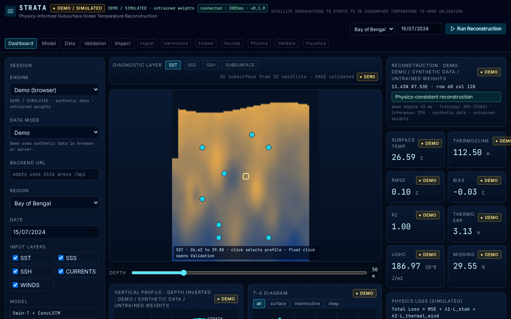
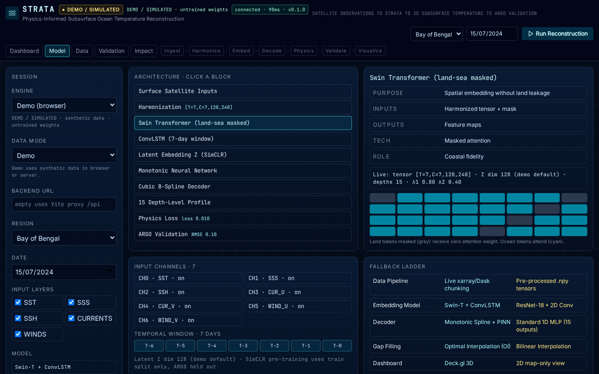
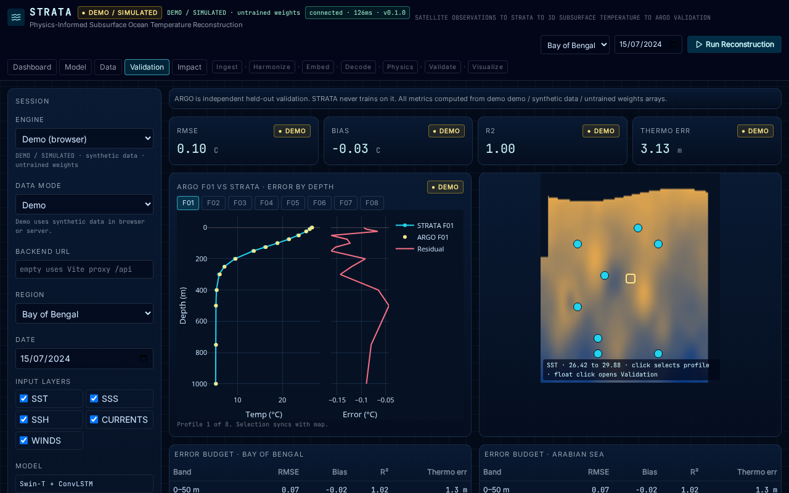
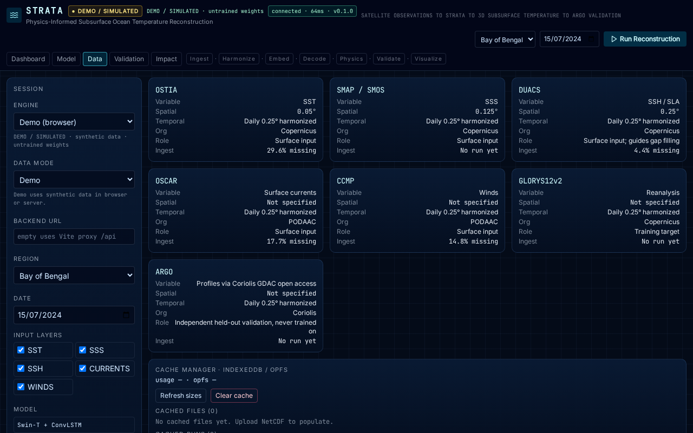
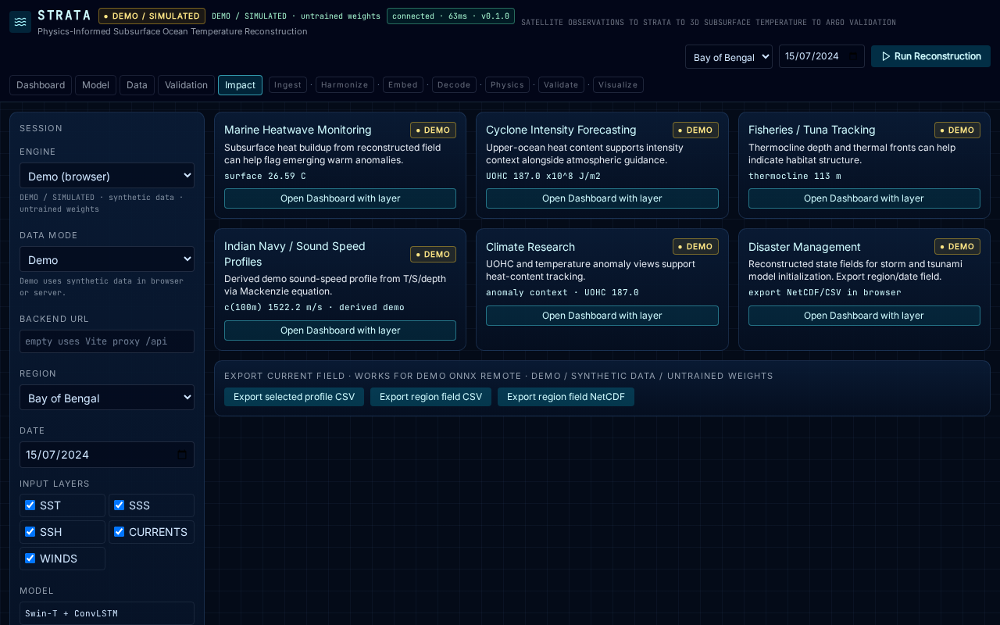
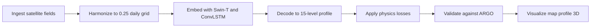

# STRATA

Physics-Informed Subsurface Ocean Temperature Reconstruction

[](LICENSE)


STRATA reconstructs 3D subsurface ocean temperature from 2D satellite observations (SST, SSS, SSH, currents, winds) and validates against ARGO floats, with a PoC focus on the Bay of Bengal and Arabian Sea.

## Project status

> The app currently runs on deterministic synthetic demo data and untrained weights. Outputs are labeled DEMO / SIMULATED and are not scientific results. GLORYS12v2 training is future work.

All reconstruction panels carry a DEMO badge, provenance strings read `demo / synthetic data / untrained weights` or `remote / synthetic data / untrained weights`, and validation is against synthetic ARGO-like profiles until real training lands.

## Screenshots

Captured with Playwright against the production build and local API.







The dashboard screenshot shows the reconstructed field map, depth slider, vertical profile with inverted depth axis and 15 markers, T-S diagram, and 3D view. Model, validation, data, and impact routes are shown in the remaining captures.

## Features

- Deterministic demo engine in the browser: same region, date, layers, mode, and physics give identical output.
- Five routes: Dashboard, Model, Data, Validation, Impact with cross-links and deep-link restore via `?region&date&depth&engine&mode`.
- 15 depth levels from 0 to 1000 m on a 120 by 240 grid at 0.25 degrees.
- Physics losses: static-stability term on temperature gradient plus thermal-wind residual, combined as `Total = MSE + λ1·L_stab + λ2·L_thermal_wind`.
- Monotonic temperature enforcement in code: reconstructed temperature never increases with depth when enabled.
- Gap filling with Optimal Interpolation, SSH-guided, and bilinear fallback.
- Remote engine over FastAPI with Server-Sent Events stage progress, cancel, and structured errors including `credentials_not_configured`.
- ONNX path with explicit untrained-weights messaging and OPFS model lookup.
- Offline mode with badge, cached runs in IndexedDB, and Demo continuity without network.
- Validation views: ARGO profile comparison, error-budget tables by depth band, thermocline depth error, UOHC, RMSE, Bias, R².
- Impact views with Mackenzie sound-speed derivation and CSV plus NetCDF-like export in the browser.
- Full test suite: Vitest unit and component, fast-check properties, pytest backend, hypothesis properties, contract, golden, and Playwright end-to-end with axe checks.

## How it works



| Stage | What happens |
| --- | --- |
| Ingest | Load SST, SSS, SSH, currents, winds for region and date |
| Harmonize | Regrid to 120 by 240 at 0.25 degrees, fill cloud gaps |
| Embed | Swin-T spatial plus ConvLSTM 7-day temporal state |
| Decode | Map latent state to temperature at 15 depths |
| Physics | Add stability and thermal-wind terms to the loss |
| Validate | Score against held-out ARGO profiles |
| Visualize | Render map, profile, T-S, 3D, and metrics |

Fallback ladder:

| Layer | Preferred | Fallback |
| --- | --- | --- |
| Data Pipeline | Live xarray and Dask chunking | Pre-processed .npy tensors |
| Embedding Model | Swin-T + ConvLSTM | ResNet-18 + 2D Conv |
| Decoder | Monotonic Spline + PINN | Standard 1D MLP with 15 outputs |
| Gap Filling | Optimal Interpolation (OI) | Bilinear Interpolation |
| Dashboard | Deck.gl 3D | 2D map-only view |

Engine modes in the app select rows of this ladder: `swin-monotonic-oi`, `resnet-monotonic-oi`, `swin-mlp-oi`, `swin-monotonic-bilinear`, `map-2d-only`. Gap methods are `oi`, `gp`, `ssh`, `bilinear`.

Decoder monotonicity as implemented: the code enforces non-increasing temperature with depth. The PyTorch `MonotonicDecoder` builds strictly decreasing control points with positive softplus steps plus 0.05, the NumPy mirror does the same, and the served pipeline plus the browser engine clamp each level to at most `previous minus 0.01` when monotonic mode is on. When monotonic mode is off the pipeline deliberately injects inversions for ablation. No potential-density or sigma0 computation exists in the current code. The idea deck describes monotonicity in potential density, which the code does not implement.

## Data sources

From `web/src/lib/config.ts`. Values not present in the app are shown as Not specified.

| ID | Variable | Resolution | Org | Role |
| --- | --- | --- | --- | --- |
| OSTIA | SST | 0.05° | Copernicus | Surface input |
| SMAP / SMOS | SSS | 0.125° | Copernicus | Surface input |
| DUACS | SSH / SLA | 0.25° | Copernicus | Surface input; guides gap filling |
| OSCAR | Surface currents | Not specified | PODAAC | Surface input |
| CCMP | Winds | Not specified | PODAAC | Surface input |
| GLORYS12v2 | Reanalysis | Not specified | Copernicus | Training target |
| ARGO | Profiles via Coriolis GDAC open access | Not specified | Coriolis | Independent held-out validation, never trained on |

Temporal coverage in the demo is the fixed date list `2024-01-15, 2024-04-15, 2024-07-15, 2024-10-15, 2025-01-15`. Harmonized output is daily at 0.25 degrees once a run completes.

## Tech stack

| Area | Stack |
| --- | --- |
| Frontend | React 18, Vite 6, TypeScript 5, React Router 6, Zustand, XState 5 |
| Visualization | MapLibre GL, deck.gl 9, Plotly, Radix UI, Tailwind CSS 4 |
| Offline and data | VitePWA with CacheFirst for models, tiles, and data; IndexedDB via idb; OPFS model lookup; NetCDF and CSV export in browser |
| Backend | FastAPI, Uvicorn, Pydantic v2, SSE stage stream |
| ML and training | PyTorch, TorchVision, Lightning, ONNX export, xarray, Dask, scikit-learn, SciPy, NetCDF4, h5netcdf, Zarr |

## Quickstart

Prerequisites verified here with Node v26.10.0, npm 12.2.0, and Python 3.14 with the repo `.venv`. The project requires Node 20 or newer and Python 3.11 or newer.

```sh
git clone https://github.com/Punity122333/SIH-2026-TARANG-PROJECT.git
cd SIH-2026-TARANG-PROJECT
npm install
npm run dev
```

Open the printed Vite URL, usually `http://localhost:5173`. `npm run dev` starts the Vite web app on 5173 and the FastAPI server on 8000 together. If Python dependencies are missing the web app still works in Demo mode.

Backend health:

```sh
curl http://localhost:8000/api/health
```

Frontend uses the Vite proxy `/api` by default. Override with `VITE_STRATA_API_URL` or the Backend URL field in Session controls.

### Demo mode

Demo mode works with no backend and no network. Pick Engine `Demo (browser)`, Data mode `Demo`, a region and date, then Run Reconstruction. All outputs are labeled DEMO / SIMULATED.

### Remote mode with backend

```sh
npm run dev
```

Pick Engine `Remote (backend)` and Run. The UI streams stage progress from `GET /api/stream/reconstruct` and falls back to `POST /api/reconstruct`. Provenance reads `remote / synthetic data / untrained weights`.

### Live mode with real SST

Live mode is SST-first. Observed OSTIA SST flows into Live reconstructions and other inputs stay synthetic until their adapters land.

```sh
pip install copernicusmarine
set -a; . ./.env; set +a
npm run dev
```

Then pick Data mode `Live` and Run. Downloads cache under `artifacts/live` keyed by region and date. Without credentials the server answers 503 with `credentials_not_configured` and the missing variable names. Without the package it falls back explicitly per source and says so in provenance. Model weights are still untrained, so Live output is real observations through an untrained model.

Environment variables from `.env.example`. Copy to `.env` locally and never commit it.

| Name | Purpose | Required |
| --- | --- | --- |
| COPERNICUS_USERNAME | Copernicus Marine login for OSTIA SST | Optional, required for Live |
| COPERNICUS_PASSWORD | Copernicus Marine password for OSTIA SST | Optional, required for Live |
| NASA_EARTHDATA_TOKEN | NASA Earthdata token for SSS, currents, winds adapters | Optional, required for Live |
| INCOIS_LAS_URL | Optional INCOIS LAS endpoint | Optional |
| INCOIS_LAS_KEY | Optional INCOIS LAS key | Optional |
| CORIOLIS_CONFIG | Optional Coriolis ARGO config | Optional |
| WANDB_API_KEY | Weights and Biases key for training runs | Optional |
| STRATA_API_URL | Public API base when frontend and backend are split | Optional |

Python and conda setup for xESMF regridding:

```sh
conda env create -f environment.yml
conda activate strata
```

`environment.yml` pins Python 3.11 with numpy, scipy, xarray, netCDF4, h5netcdf, zarr, dask, scikit-learn, PyTorch, Lightning, xESMF, ESMF, plus pip packages for ONNX, FastAPI, and live adapters. The demo and test suite run without xESMF; it is needed only for conservative regridding experiments.

## Testing

```sh
npm run test:all
npm run check
```

`npm run test:all` runs frontend unit with coverage, backend pytest, production build, and Playwright end-to-end. `npm run check` runs web typecheck, lint, unit tests, Python pytest, ruff, mypy, and the no-comments check.

Suites:

```sh
npm --prefix web run test -- --run --coverage
PYTHONPATH=python .venv/bin/python -m pytest python/tests -q
npm --prefix web run build
npm --prefix web run test:e2e
```

Coverage is v8 on the frontend and pytest-cov on the backend. Thresholds enforced in config are at least 85 percent lines on engine, metrics, physics, and validation code and 70 percent overall. The test command fails below these thresholds. Read reports at `web/coverage/index.html` and the pytest terminal summary. Do not add empty or assertion-free tests to raise coverage.

Test hygiene: no fixed sleeps in Playwright, Vitest shuffles with seed `20260715`, pytest runs with random order, seeds are fixed, and tests use only local servers at `http://localhost:4173` and `http://localhost:8000`.

## Project structure

```text
web/src/engine/demo/engine.ts  Deterministic demo reconstruction and metrics
web/src/engine/schema.ts       Shared remote payload schema and validation
web/src/store/session.ts       Zustand session, run, cancel, URL restore
web/src/store/machine.ts       XState seven-stage pipeline machine
web/src/components/            Map, ProfileChart, PhysicsLossPanel, DataCards, FallbackLadder, badges
web/src/routes/                Dashboard, Model, Data, Validation, Impact
web/e2e/                       Playwright specs against build plus API
python/strata/physics/         Stability and thermal-wind losses
python/strata/validation/      RMSE, Bias, R2, thermocline error, UOHC
python/strata/harmonize/       Regrid and OI plus bilinear gap filling
python/strata/models/          Torch and NumPy encoders plus monotonic decoder
python/strata/data/            Synthetic tensors, splits, live OSTIA adapter
python/api/                    FastAPI app, schemas, reconstruct and stream routes
python/tests/                  Pytest suite with contract and golden references
scripts/                       No-comments checker and coverage gate
docs/images/                   Playwright screenshots used above
```

## Limitations and roadmap

- Model is untrained. All weights are random or analytic demo placeholders.
- GLORYS12v2 training run has not been done. The reanalysis is listed as the training target only.
- Real-data validation against held-out ARGO has not been done. Current validation uses synthetic profiles.
- Live mode ingests only OSTIA SST. Other live adapters are future work.
- No claims beyond the above. Outputs must not be used as scientific results.

Roadmap is a GLORYS12v2 training run, real-data validation against held-out ARGO floats, then live adapter completion.

## Team and context

Team TARAANG, Smart India Hackathon 2026, problem statement SIH26066 (OceanEmbed), Team ID TR069.

## License

GPL-3.0. See [LICENSE](LICENSE).
